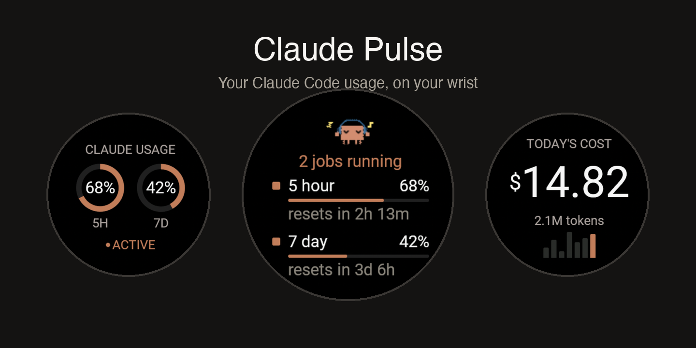
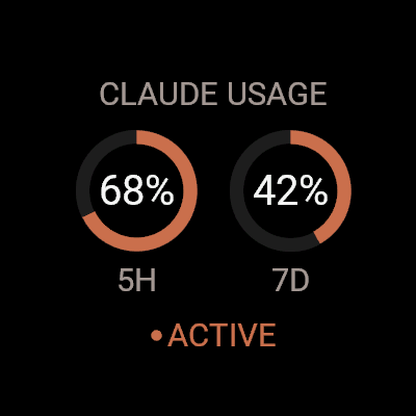
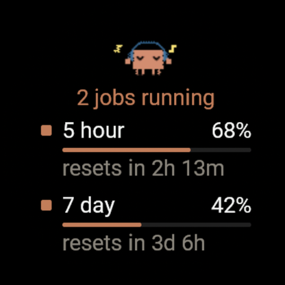
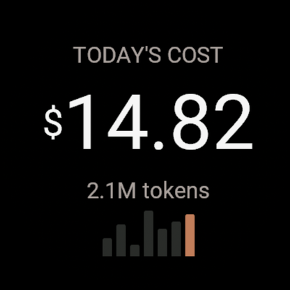

<div align="center">



# Claude Pulse

**Your Claude Code usage, on your wrist.**

[](https://github.com/biokraft/claude-pulse/actions/workflows/ci.yml)
[](LICENSE)
[](relay/go.mod)
[](watch/manifest.xml)

</div>

Claude Pulse is a Garmin watch app that shows how much of your Claude Code quota you have
burned through — without reaching for your laptop. It is backed by a small relay you host
yourself, so no usage data ever passes through anyone else's server.

## How it looks

| Rings | Detail | Cost |
| :---: | :---: | :---: |
|  |  |  |
| 5-hour and 7-day quota, and whether a session is running right now | Active jobs, both quota bars, and when each window resets | Today's spend, tokens, and a 7-day history |

A glance view puts the two percentages on your watch's widget carousel, so the common case
costs you no taps at all.

## How it works

```
┌─ your machine ──────────────────────┐        ┌─ phone ──┐   ┌─ watch ─────────┐
│                                     │        │          │   │                 │
│  claude-pulse-relay                 │        │  Garmin  │   │  Claude Pulse   │
│   ├─ polls Anthropic usage API      │        │  Connect │   │                 │
│   ├─ watches ~/.claude for sessions │  HTTPS │  Mobile  │   │  background     │
│   ├─ ingests cost from a statusline │ ─────► │          │──►│  fetch, 5 min   │
│   │  hook (optional)                │        │          │   │                 │
│   └─ GET /api/v1/snapshot           │        │          │   │                 │
└─────────────────────────────────────┘        └──────────┘   └─────────────────┘
```

The relay reads your local Claude Code credentials, polls Anthropic for usage, and serves a
single authenticated JSON snapshot. The watch fetches that snapshot through your paired
phone every five minutes using Connect IQ's background API. Your credentials never leave
your machine, and the snapshot endpoint never exposes them.

Connectivity is your choice: the relay can open a Cloudflare quick tunnel for you, or you
can point it at your own reverse proxy or Tailscale network with `--no-tunnel`.

## Quickstart

**1. Install the relay** (macOS or Linux, with Claude Code installed and logged in):

```bash
curl -fsSL https://raw.githubusercontent.com/biokraft/claude-pulse/main/install.sh | bash
```

This builds `claude-pulse-relay` from source (needs Go 1.25+) and installs it to
`~/.local/bin`, then tells you what to do next. Override the location with
`PREFIX=/usr/local/bin`. Prefer to do it by hand? `cd relay && go build -o
claude-pulse-relay ./cmd/claude-pulse-relay` — note the `cd`, the Go module lives in
`relay/`, not the repo root.

**To upgrade later, run that same command again.** It detects the existing install,
replaces the binary, restarts your service on the new version if you have one, and
leaves `~/.claude-pulse/` — your token and cost history — untouched.

**2. Start it:**

```bash
claude-pulse-relay
```

It generates a config with a random token, opens a Cloudflare tunnel, and prints a URL, a
token and a QR code. `claude-pulse-relay help` lists every command.

**3. Install the watch app** from the Connect IQ Store, then open **Garmin Connect →
Connect IQ apps → Claude Pulse → Settings** and enter that URL and token.

That's it. Two optional extras: `claude-pulse-relay service install` keeps the relay
running across reboots, and `claude-pulse-relay hook install` feeds the cost page from a
Claude Code statusline hook.

Full relay documentation — running as a background service, token rotation, the snapshot
API, credential handling — lives in [relay/README.md](relay/README.md).

## Repository layout

| Path | What's in it |
| --- | --- |
| [`watch/`](watch) | The Connect IQ app: Monkey C sources, resources, manifest, unit tests |
| [`relay/`](relay) | The self-hosted Go daemon and its packages |
| [`scripts/`](scripts) | Dev-key generation, simulator screenshots, store-asset build |
| [`docs/`](docs) | The design spec the watch views are built against |
| [`design/`](design) | Mockups and mascot sprites |

## Development

The relay needs Go 1.25+; the watch app needs the
[Connect IQ SDK](https://developer.garmin.com/connect-iq/sdk/) and a JDK.

```bash
# relay
cd relay && go test -race ./...

# watch app: unit tests in the simulator
export JAVA_HOME=/opt/homebrew/opt/openjdk
SDK="$(ls -d "$HOME/Library/Application Support/Garmin/ConnectIQ/Sdks"/*/bin | tail -1)"
./scripts/gen-dev-key.sh                       # one-time, writes developer_key.der (git-ignored)
"$SDK/monkeyc" --unit-test -f watch/monkey.jungle -d fr57047mm -o /tmp/t.prg -y developer_key.der
"$SDK/monkeydo" /tmp/t.prg fr57047mm -t
```

Both suites run on every push — see [`.github/workflows/ci.yml`](.github/workflows/ci.yml).

Watch layouts are built against [`docs/design-spec.md`](docs/design-spec.md), which pins
every measurement to the mockup's 400 px reference screen. `scripts/shoot-pages.sh` captures
each page from the simulator and `scripts/build-store-assets.py` turns those captures into
the store upload folder; [`CLAUDE.md`](CLAUDE.md) explains both.

Contributions are welcome — see [CONTRIBUTING.md](CONTRIBUTING.md). For anything
security-related, [SECURITY.md](SECURITY.md) has the disclosure process.

## Found a bug? Please open an issue

Genuinely — [open one](https://github.com/biokraft/claude-pulse/issues/new/choose). There
are templates for [bug reports](.github/ISSUE_TEMPLATE/bug_report.yml),
[feature ideas](.github/ISSUE_TEMPLATE/feature_request.yml) and
[device reports](.github/ISSUE_TEMPLATE/device_report.yml).

**Device reports are the most useful thing you can send.** The app ships to 70 Garmin
models and I own exactly one of them, so every other device's layout is educated
guesswork. If something clips, overlaps or just looks off on your watch, a photo of the
watch face and the model name is enough to get it fixed.

Questions and half-formed ideas belong in
[Discussions](https://github.com/biokraft/claude-pulse/discussions). Security issues go
through [SECURITY.md](SECURITY.md) instead — please don't file those publicly.

## Caveats

- Usage comes from an **undocumented** Anthropic endpoint (`/api/oauth/usage`). It may
  change or disappear without notice.
- The tunnel URL and token together grant read access to your usage snapshot. Treat them
  like a password; rotate as described in the relay README.
- Quick-tunnel URLs rotate on every relay restart. Run the relay as a service to make
  restarts rare.

## License

[MIT](LICENSE) © Seán Baufeld. Use it freely; keep the attribution.

Claude and Claude Code are trademarks of Anthropic. This is an independent, unofficial
project, not affiliated with or endorsed by Anthropic.
